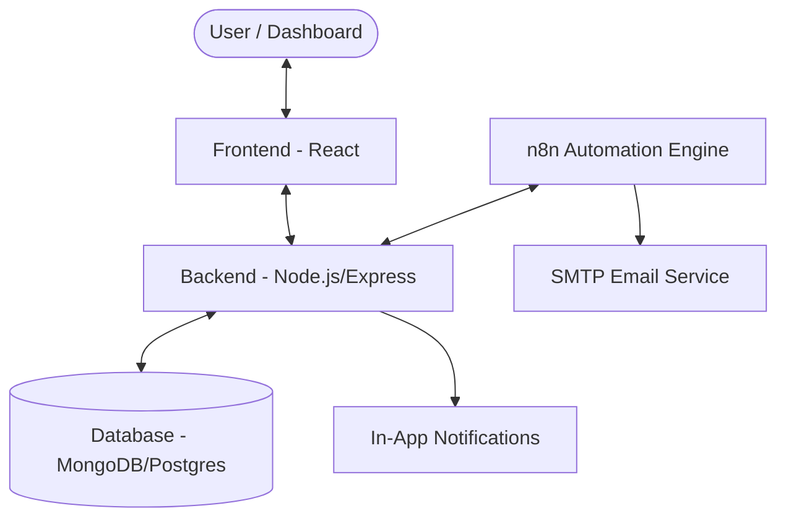

# 🔄 RMS System & Automation Flow

This document explains how the Request Management System (RMS) components interact and how data flows through the automation layer.

---

## 1. System Architecture
The system consists of four main layers communicating in a loop:

---

## 2. The Reminder Flow (Time-Based)
This flow is **scheduled** (runs automatically every morning).

1. **Wait**: n8n Trigger waits until 8:00 AM.
2. **Scan**: n8n calls the Backend `GET /pending-reminders`.
3. **Filter**: Backend searches the DB for requests where `status` is NOT completed AND `dueDate` is within 3 days (or overdue).
4. **Notify**: 
   - n8n sends an **Email** to the assignee.
   - n8n calls the Backend `POST /notifications` to trigger the **In-App Bell** icon.

---

## 3. The Report Flow (Event-Based)
This flow is **triggered** by a user action.

1. **Trigger**: User clicks "Export Report" in the Dashboard.
2. **Job Creation**: Backend creates a `ReportJob` (status: `pending`) and sends a Webhook to n8n.
3. **Processing**: n8n receives the `reportId`, then calls the Backend to fetch the specific data needed for that report type.
4. **Completion**: n8n sends the resulting data back to the Backend.
5. **Update**: Backend updates the DB to `completed` and sends a "Report Ready" socket notification to the User.

---

## 4. Key Values to Enter in the App
For these automations to work correctly, you must ensure these fields are filled in the Application:

### For Reminders:
Values entered when creating or editing a **Request**:
- **Assignee**: Must be a valid user with a working email address.
- **Due Date**: A date in the future (for reminders) or the past (for overdue alerts).
- **Status**: Must be `submitted`, `in_review`, or `pending_info`. (Completed requests are ignored).

### For Reports:
Values entered in the **Report Settings**:
- **Report Type**: 
  - `Summary`: Overall system stats.
  - `Program`: Stats for a specific program.
  - `Overdue`: List of strictly overdue items.
- **Date Range**: Optional filters often passed to n8n to narrow down the data.

---

## 5. Security Interconnection
The Backend and n8n talk to each other securely using the **Internal API Key**:

| Direction | Method | Security | Purpose |
| :--- | :--- | :--- | :--- |
| **App -> n8n** | Webhook | Secret Header | Triggering background tasks |
| **n8n -> App** | HTTP | `x-api-key` | Fetching data or updating status |

---

## 6. URLs Summary
- **Backend (Internal)**: `http://host.docker.internal:5000` (Used inside n8n)
- **Frontend**: `http://localhost:3000` (Used in email links)
- **n8n Dashboard**: `http://localhost:5678` (For admin/setup)
